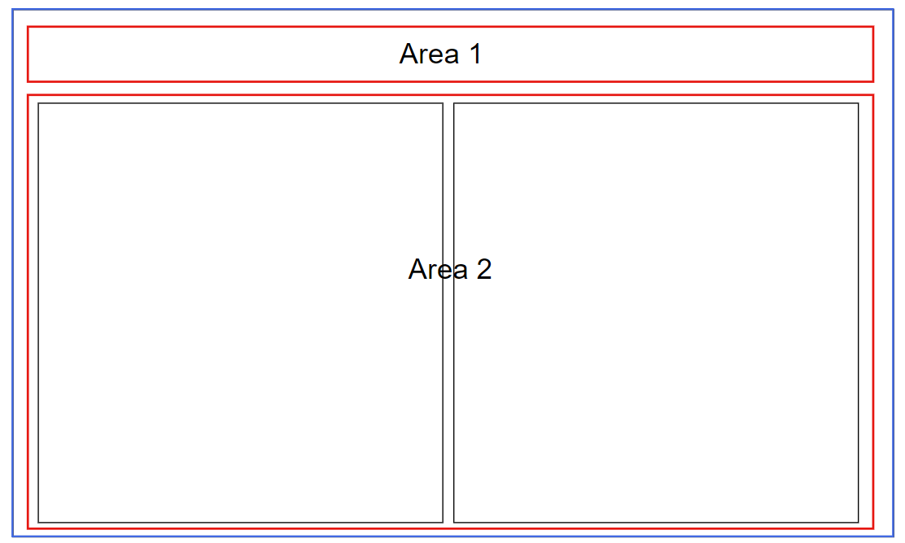
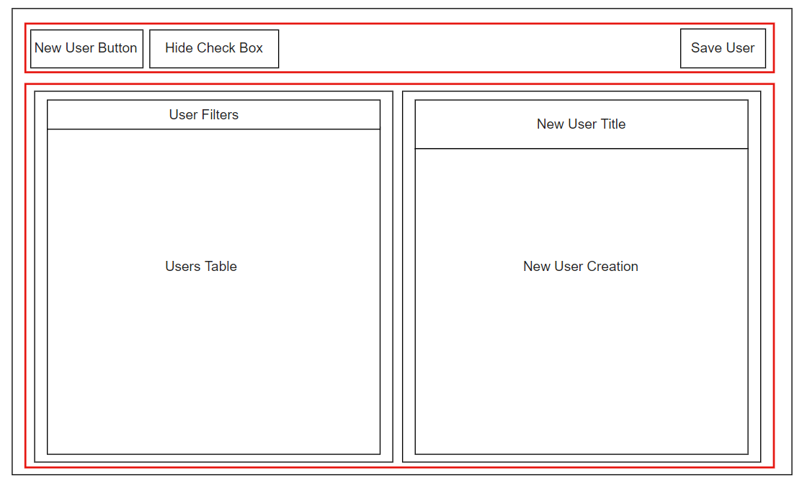

User Interface Specification Document
=====================================

Main Contents
=============

This document shows the user interface design specifications for the user management application. Pages included in this document are given below.

-   User Management Screen

User Management Screen
======================

The user management screen consists of two main areas, containers that include inner components. In Figure-1 it can be seen that Area 2 consists of two inner containers that are row aligned. Thus, the blueprint components of this screen structure is given below which is further discussed in the rest of the report.

-   Area 1
-   Area 2

      Figure-1

      Figure-2

Area 1
------

As in Figure-2 “Area 1” consists of a single container that includes components directly on it.

#### New User Button

In this field, there will be a button that will enable the user to create a new user within the system. When this button has pressed the container on the right side, “Right Sub-Area” which is in “Area 2” will be shown. The necessary element in this field is

-   New User \<Button\>

#### Hide Check Box

In this field, there will be a check box that will enable the users to filter the result based on the availability of users within the system. If it was selected the unavailable users will not be shown in the table view. If it is not the unavailable users will be shown also. The necessary element in this field is

-   \<CheckBox\>, Hide Disabled User \<Text\>

#### Save User Button

In this field, there will be a button that will enable the user to save a new user to the system. When this button has pressed the container on the right side, “Right Sub-Area” which is in “Area 2” will disappear. The necessary element in this field is

-   Save User \<Button\>

Area 2
------

As in Figure-2 “Area 2” consists of two sub-containers which include specific components.  

### Left Sub-Area

#### User Filters

This field will include the filter for the table. It will provide the functionality for filtering the table data. The necessary elements in this field are (they will be shown as a single row)

-   ID \<Button\>, User Name \<Button\>, Email \<Button\>, Enables \<Button\>

#### Users Table

This field will include a table that will show the user the registered users in the system. The table will have 4 columns which include the properties for ID, User Name, Email, Enabled. The corresponding fields in the table should include the information for these properties. The necessary element in this field is

-   \<TableView\>

### Right Sub-Area

When the page has first opened the container on the right side should not be shown by default. It should be available to the user when the user clicks on the “New User Button” in the “Area 1”. After the user confirms the new user by clicking “Save User Button” this container should disappear from the screen, it should be invisible. This right container’s visibility will depend on the user’s actions. The sub-right sub-container includes two components that are column aligned.

#### New User Title

This field will only include a header named “New User“. The necessary element in this field is

-   New User \<Header\>

 

#### New User Creation

This field will include the necessary text fields to take input from the user to create a new user in the system. The necessary elements in this field are

-   Username \<Text\>, \<TextInput\>
-   Display Name \<Text\>, \<TextInput\>
-   Phone \<Text\>, \<TextInput\>
-   Email \<Text\>, \<TextInput\>
-   User Roles \<Text\>, \<Select\>
-   Enabled \<Text\>, \<CheckBox\>.

